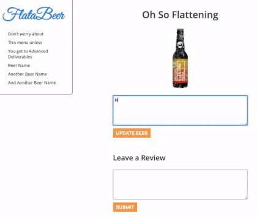

Author
Josephine Mueni Nzioka

Title
FlataBeer  1 challenge

 How it works
1) click the nav list to display name, image ,description and reviews
2) add a review
3) click on the review it will clear without affecting the rest of old reviews
4) update and click an image of your choice
Demo

steps to create the app

Html contains a nav Ul with an id beer_list
two forms with a label and textarea and button to update and submit reviews
Script file which makes the file dynamic by adding functionality
run json server with $ json-server --watch db.json
"http://localhost:3000/beers"; store the url in beerApi
then fetch data
create h2 and image with createElement method to render data into the html

pass the data by creating a function to load and display data and get reviews where you too can update it and remove the current review

This repo is open private source  where the TMs can rate and give  comments /update and any other help which can help to make the code simple

name: Josephine Mueni Nzioka
Part time student at Moringa School 